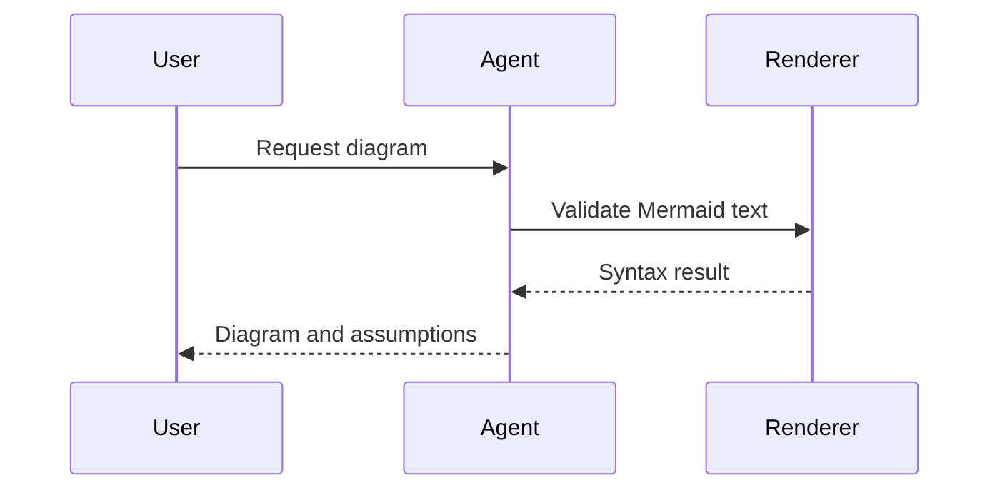
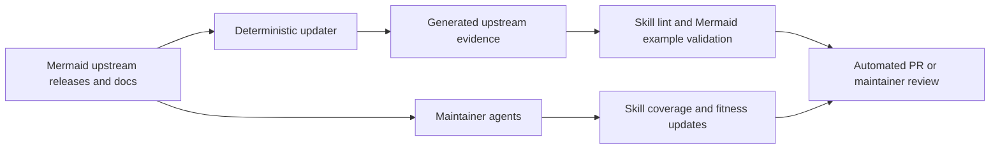

# Mermaid.js for Agents

[](https://agentskills.io/)
[](https://docs.tessl.io/)
[](https://pi.dev/packages)
[](LICENSE)

A pre-release context package that teaches AI coding agents to create and repair
[Mermaid.js](https://github.com/mermaid-js/mermaid) diagrams.

The repository includes self-maintenance automation: deterministic upstream evidence tracking plus
GitHub Agentic Workflow source for maintainer agents that keep the skill fit for purpose, aligned
with Mermaid upstream, and broad enough for the diverse diagramming scenarios coding agents
encounter. The agentic workflow source must be compiled before scheduled maintainer agents run.

It is designed once and packaged for Tessl, Pi, Claude Code, Codex, and any harness that understands
the Agent Skills standard.

## Reader and outcome

This README is for agent-tool maintainers, docs engineers, and open-source contributors. After
reading it, you should be able to install the package in your preferred agent harness and understand
how it stays aligned with Mermaid upstream.

## Product contract

- **User-facing promise:** teach agents to create and repair Mermaid.js diagrams.
- **Self-maintenance promise:** use deterministic upstream evidence and maintainer-agent workflow
  source to keep that skill fit for purpose, current with Mermaid, and comprehensive across diverse
  diagramming scenarios once the workflow is compiled/configured.
- **Packaging promise:** ship the same canonical skill to Tessl, Pi, Claude Code, Codex, and generic
  Agent Skills consumers.

See `docs/product-intent.md` for the alignment contract and non-goals.

## What ships

- **Portable Agent Skill** for Mermaid diagram creation and repair.
- **Focused references and evals** that cover diagram choice, syntax patterns, renderer
  compatibility, and repair scenarios.
- **Tessl tile manifest** with docs, steering rules, eval scaffolding, and skill metadata.
- **Pi package metadata** so Pi can load the skill from the package.
- **Claude Code plugin metadata** with namespaced plugin support.
- **Codex plugin metadata and marketplace entry** for local/repo installation.
- **Self-maintenance automation** that combines deterministic upstream evidence with GitHub Agentic
  Workflow maintainer agents.
- **OSS DX** with formatting, linting, commit linting, tests, Husky hooks, Changesets, and CI.

## Quick start

```bash
npm install
npm run check
```

Use the skill in an agent session by asking for Mermaid directly:

```text
Create a Mermaid sequence diagram for a user requesting a diagram, an agent drafting it,
and a renderer validating it.
```

Expected style of output:



## Install by harness

### Tessl

Validate and publish from the personal `henryennis` Tessl workspace:

```bash
tessl skill lint .
tessl skill review .
tessl skill publish . --workspace henryennis
```

For quality measurement, generate scenarios and run evals:

```bash
tessl scenario generate . --count=5 --workspace=henryennis
tessl scenario download --last
tessl eval run .
```

### Pi

Install from a local checkout while developing, using project-local Pi settings:

```bash
pi install ./ -l
```

For this repository's own Pi sessions, `.pi/settings.json` loads the package skill from the repo
checkout. The helper `npm run install:local -- --target .` creates project-local harness links
without mutating global agent settings.

### Claude Code

Load the repo as a Claude plugin during development:

```bash
claude --plugin-dir .
```

The Claude plugin manifest is metadata; the packaged skill lives under package-root `skills/`.
Before public launch, verify and document the exact Claude Code version that discovers this layout.

### Codex

Use the included Codex plugin manifest and local marketplace entry. From a Codex session, add or
browse the repo marketplace, then install **Mermaid.js for Agents**.

You can also copy or symlink the skill into a Codex skills directory for local authoring.

## Self-maintaining skill fitness

The user-facing skill teaches agents to create and repair Mermaid diagrams. The repository
maintenance system keeps that skill fit for purpose. It has two layers:



- The deterministic updater records an immutable Mermaid release, docs directories, and diagram
  implementation directories. This is evidence, not the product.
- GitHub Actions can run the updater on a schedule and open a pull request when generated references
  change.
- GitHub Agentic Workflows provide the semantic layer: maintainer agents review upstream changes,
  judge whether the skill still covers what coding agents need to know about creating and repairing
  diagrams, update guidance or evals, and propose a safe PR instead of silently changing behavior.

## Development commands

| Command                    | Purpose                                                                             |
| -------------------------- | ----------------------------------------------------------------------------------- |
| `npm run check`            | Format check, lint, tests, parser-backed Mermaid validation, and pack smoke checks. |
| `npm run generate`         | Refresh upstream Mermaid evidence metadata.                                         |
| `npm run validate:mermaid` | Parser-validate Mermaid code fences and `.mmd` assets.                              |
| `npm run agentic:compile`  | Compile GitHub Agentic Workflow Markdown after frontmatter changes.                 |
| `npm run tessl:lint`       | Run Tessl skill linting.                                                            |
| `npm run tessl:eval`       | Run Tessl evals when scenarios are present.                                         |

## Release process

1. Add a Changeset for user-visible package changes.
2. Run `npm run check`.
3. Merge to `main`.
4. Npm publishing is deferred for now; keep release publishing gated until registry launch.
5. Publish the Tessl tile from the same version from the `henryennis` workspace once Tessl
   validation passes.

## Project status

This project starts at `0.1.0` as a private beta / pre-release candidate: the package format, skill
router, references, automation source, parser-backed validation, and evals are in place. Before a
public registry launch, finish Tessl CLI validation, enable GitHub private vulnerability reporting,
confirm npm publishing credentials or trusted publishing, and compile/configure the GitHub Agentic
Workflow artifact.
