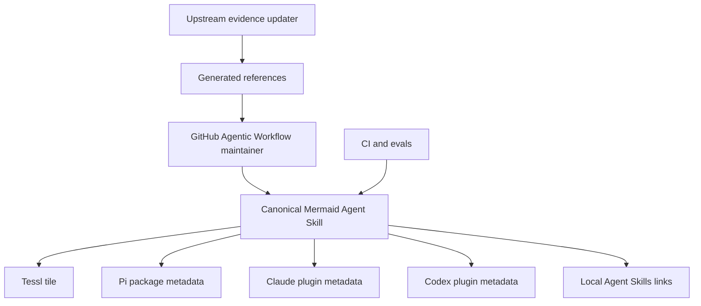

# Architecture

Mermaid.js for Agents uses one canonical skill and several thin packaging adapters.

## Design choices

### One canonical skill

All harnesses should load the same skill content. Harness-specific files only describe packaging and
discovery. This avoids parallel prompt drift.

### Progressive disclosure

The skill body is a router. Detailed syntax and maintenance guidance lives in references and
workflows that agents read only when needed.

### Deterministic before agentic

The updater produces a factual upstream snapshot. Agentic maintenance starts from that snapshot and
only changes create/repair guidance when upstream changes, repo feedback, or eval gaps require
judgment.

### Validation is package-local

Skill linting, workflow linting, Mermaid example validation, and tests are ordinary npm scripts so
CI, local hooks, and agents all exercise the same checks.
