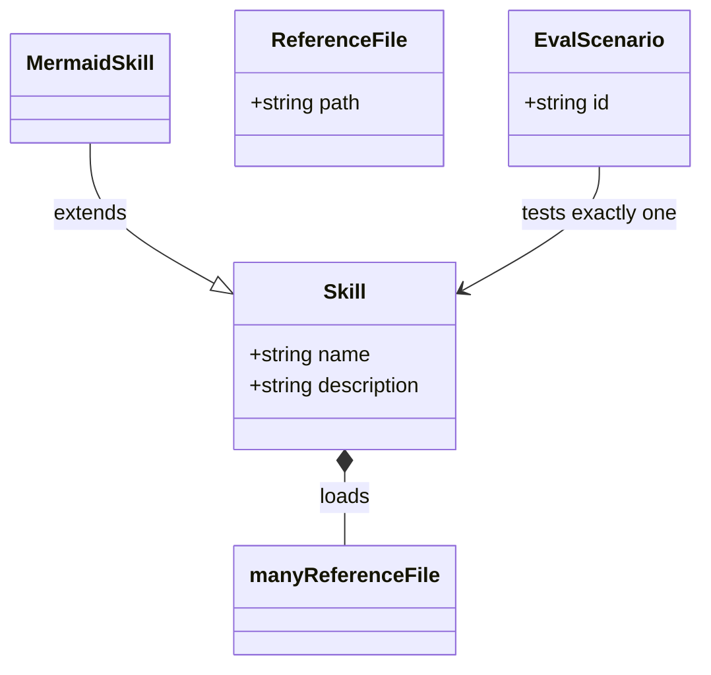

Repair this Mermaid class diagram while preserving the intended model and relationships. Return the
fixed diagram first and then one short explanation sentence.

```mermaid
classDiagram
  class Skill {
    +string name
    +string description
  }
  class MermaidSkill
  class ReferenceFile {
    +string path
  }
  class EvalScenario {
    +string id
  }

  MermaidSkill --|> Skill : extends
  Skill *-- many ReferenceFile : loads
  EvalScenario --> Skill : tests exactly one
```
