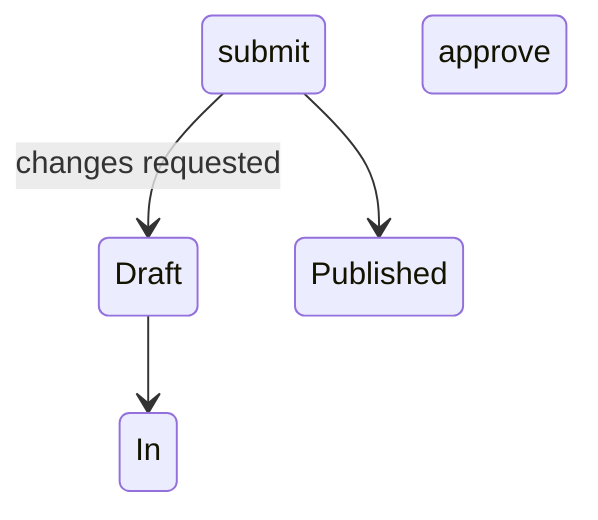

The user has a broken lifecycle diagram:

```mermaid
stateDiagram-v2
  Draft --> In Review: submit
  In Review --> Published approve
  In Review --> Draft: changes requested
```

Repair the Mermaid syntax while preserving the lifecycle semantics, then explain the smallest
repair.
