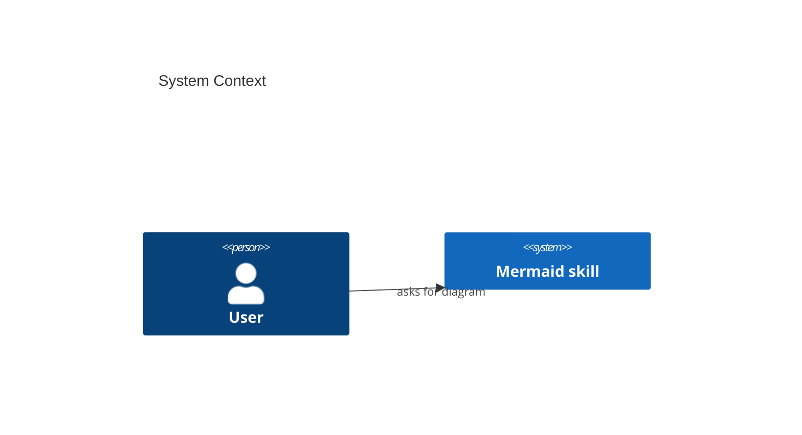
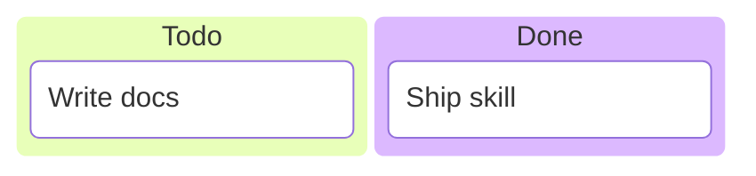
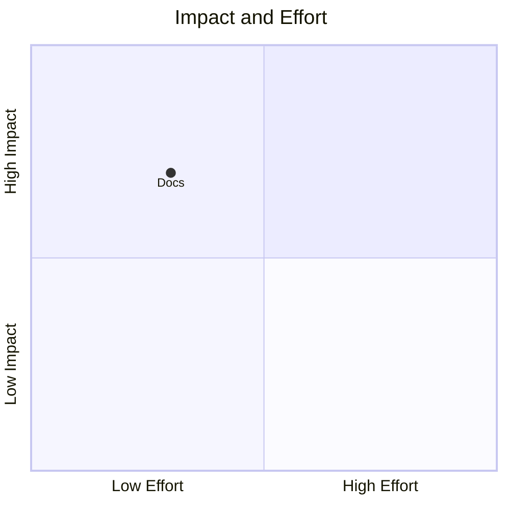
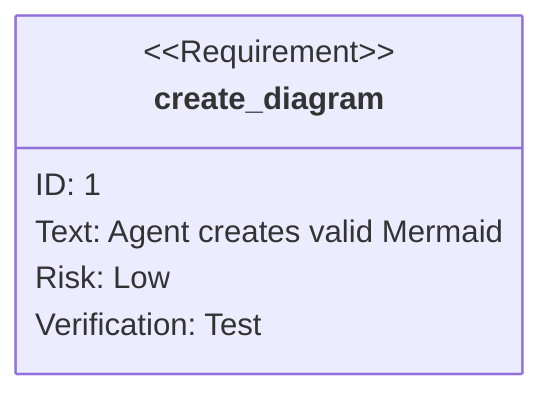
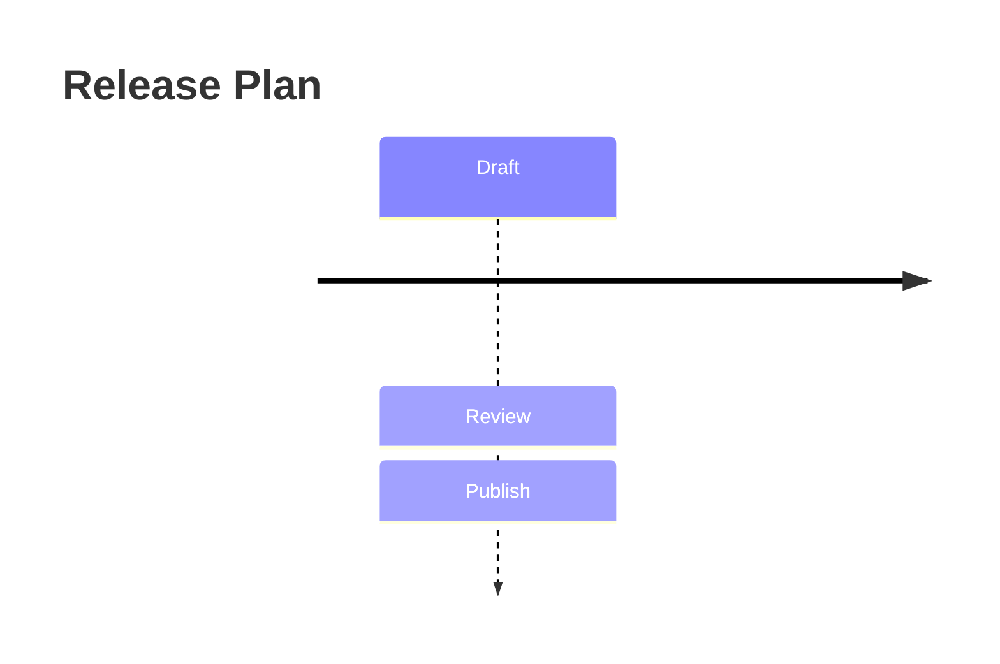
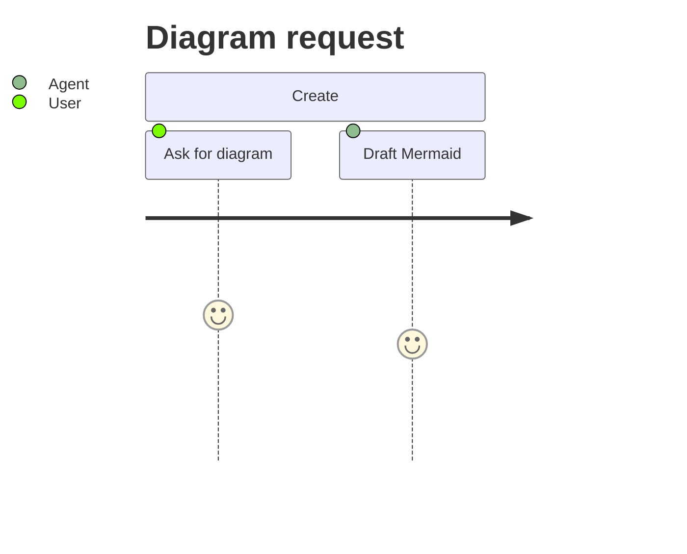
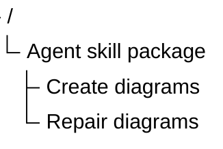

# Mermaid diagram coverage matrix

Use this matrix when a request names a less common Mermaid diagram type or when upstream evidence
mentions a new diagram source directory. `supported` means this package has at least one
parser-validated example for the tracked Mermaid release. `needs research` means upstream source is
present, but this skill should not claim reliable creation guidance yet.

| Upstream source dir | Starter(s)                                                             | Status         | Renderer portability              | Notes                                                                   |
| ------------------- | ---------------------------------------------------------------------- | -------------- | --------------------------------- | ----------------------------------------------------------------------- |
| architecture        | `architecture-beta`                                                    | beta           | Limited; offer flowchart fallback | Use for architecture notation only when target renderer supports it.    |
| block               | `block-beta`                                                           | beta           | Limited                           | Good for layout blocks; fallback to flowchart for GitHub portability.   |
| c4                  | `C4Context`, `C4Container`, `C4Component`, `C4Dynamic`, `C4Deployment` | supported      | Mixed                             | Use when user asks for C4 notation.                                     |
| class               | `classDiagram`                                                         | supported      | Broad                             | Good for code/API shape.                                                |
| er                  | `erDiagram`                                                            | supported      | Broad                             | Good for data models.                                                   |
| flowchart           | `flowchart`, `graph`                                                   | supported      | Broad                             | Default README-safe choice.                                             |
| gantt               | `gantt`                                                                | supported      | Broad                             | Use only when dates/durations exist.                                    |
| git                 | `gitGraph`                                                             | supported      | Broad                             | Use for branches, commits, release trains.                              |
| info                | `info`                                                                 | needs research | Limited                           | Internal/info diagram; avoid unless explicitly requested.               |
| ishikawa            | unknown                                                                | needs research | Unknown                           | Upstream source exists; add guidance only after parser-verified syntax. |
| kanban              | `kanban`                                                               | supported      | Mixed                             | Use for simple board/status diagrams.                                   |
| mindmap             | `mindmap`                                                              | supported      | Broad                             | Good for hierarchy/concept maps.                                        |
| packet              | `packet-beta`                                                          | beta           | Limited                           | Use for packet/bit layout only with beta caveat.                        |
| pie                 | `pie`                                                                  | supported      | Broad                             | Use for small categorical proportions.                                  |
| quadrant-chart      | `quadrantChart`                                                        | supported      | Broad                             | Use for two-axis positioning.                                           |
| radar               | `radar-beta`                                                           | beta           | Limited                           | Use for multivariate scores with beta caveat.                           |
| requirement         | `requirementDiagram`                                                   | supported      | Mixed                             | Use for requirements traceability.                                      |
| sankey              | `sankey-beta`                                                          | beta           | Limited                           | Use for flows/quantities with beta caveat.                              |
| sequence            | `sequenceDiagram`                                                      | supported      | Broad                             | Use for ordered interactions.                                           |
| state               | `stateDiagram-v2`                                                      | supported      | Broad                             | Use for lifecycle/modes/transitions.                                    |
| timeline            | `timeline`                                                             | supported      | Broad                             | Use for ordered events without durations.                               |
| treemap             | `treemap-beta`                                                         | beta           | Limited                           | Use for hierarchical quantities with beta caveat.                       |
| treeView            | `treeView-beta`                                                        | beta           | Limited                           | New in tracked release; labels must be quoted in current examples.      |
| user-journey        | `journey`                                                              | supported      | Broad                             | Use for user activities and sentiment.                                  |
| venn                | unknown                                                                | needs research | Unknown                           | Upstream source exists; add guidance only after parser-verified syntax. |
| wardley             | `wardley-beta`                                                         | beta           | Limited                           | Use for strategy/value-chain evolution with beta caveat.                |
| xychart             | `xychart-beta`                                                         | beta           | Limited                           | Use for simple x/y charts with beta caveat.                             |

## Parser-verified additions

### C4 context

### Kanban

### Quadrant chart

### Requirement diagram

### Timeline

### User journey

### TreeView beta

Use `treeView-beta` only when the renderer supports Mermaid 11.14+ beta diagrams. Prefer `mindmap`
for broader renderer compatibility.
