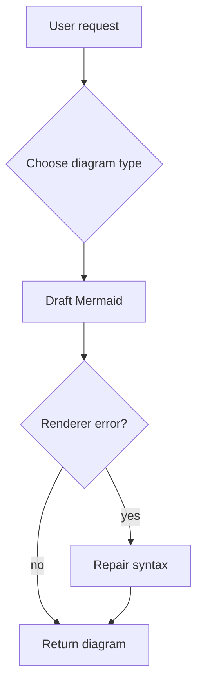

# Creation patterns for diverse Mermaid scenarios

Use this when a request has enough context to create a diagram but the best structure is not
obvious.

## Start from the communication job

| Communication job                      | Good default                                              | Creation notes                                                                                                      |
| -------------------------------------- | --------------------------------------------------------- | ------------------------------------------------------------------------------------------------------------------- |
| Explain a feature flow to contributors | `flowchart TD`                                            | Use verbs for steps and decision nodes for branches.                                                                |
| Document request/response behavior     | `sequenceDiagram`                                         | Declare participants explicitly; keep messages short.                                                               |
| Show service ownership or boundaries   | `flowchart LR` with subgraphs, C4, or `architecture-beta` | Prefer stable flowcharts for README portability; use C4/architecture when the user asks for architectural notation. |
| Explain a data model                   | `erDiagram`                                               | Use cardinality only when it is known; do not invent table fields.                                                  |
| Explain code shape                     | `classDiagram`                                            | Use methods and relationships only from known code/context.                                                         |
| Explain lifecycle/status               | `stateDiagram-v2`                                         | Use state names as nouns and transitions as events.                                                                 |
| Plan project work                      | `gantt` or `timeline`                                     | Use Gantt only when dates/durations exist; otherwise timeline.                                                      |
| Compare priorities                     | `quadrantChart`                                           | Name both axes and keep item count low.                                                                             |
| Show hierarchical concepts             | `mindmap`                                                 | Use for brainstorming and documentation outlines, not dependencies.                                                 |
| Show strategy evolution                | `wardley-beta`                                            | Mention Mermaid 11.14+ and beta renderer support.                                                                   |

## README-safe default

For public Markdown, especially GitHub, prefer a stable flowchart unless the user explicitly needs
another type:

## Large or ambiguous requests

If the user asks for a large architecture or process diagram:

1. Create a high-level overview first.
2. Name follow-up diagrams that would split the detail.
3. Avoid cramming every node into one Mermaid block.
4. Ask a clarifying question only when the missing decision changes the diagram type or semantics.

## Source-grounded diagrams

When diagramming code or a repository:

- Read enough source context before inventing relationships.
- Use labels that match real module, command, endpoint, or class names.
- Mark inferred edges in the explanation, not inside the diagram.
- Keep generated diagrams diff-friendly so maintainers can edit them later.
