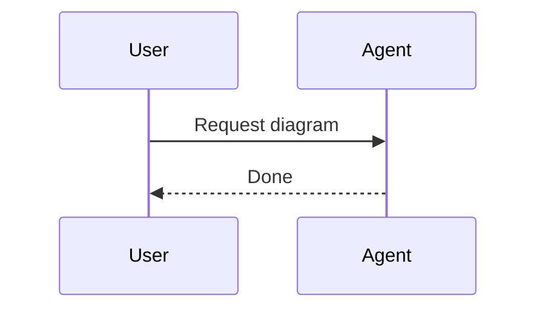
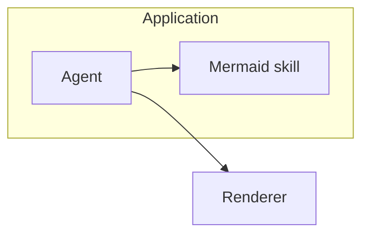

# Mermaid repair playbook

Use this when a user supplies broken Mermaid, a renderer error, or a diagram that does not render in
the target environment.

## Repair order

1. Identify the diagram type from the first meaningful line.
2. Preserve the user's nodes, participants, relationships, and labels.
3. Fix the earliest syntax-breaking issue first.
4. Re-check whether the target renderer supports the diagram type or beta feature.
5. Explain only the meaningful repair, not every formatting change.

## Common repair patterns

| Symptom                                      | Likely cause                                           | Minimal repair                                            |
| -------------------------------------------- | ------------------------------------------------------ | --------------------------------------------------------- |
| Flowchart fails near a label with `:` or `/` | Unquoted punctuation-heavy label                       | Quote the label: `node["API: /v1/items"]`.                |
| Flowchart fails near `end`                   | Node ID or label conflicts with a keyword              | Rename the ID or quote the label.                         |
| Sequence message line fails                  | Missing colon after arrow target                       | Change `A->>B Message` to `A->>B: Message`.               |
| Sequence actor name is inconsistent          | Participant aliases omitted or mistyped                | Add explicit `participant` lines.                         |
| Class diagram fails with generics            | Renderer dislikes `<T>` or nested punctuation          | Simplify or quote labels; keep the semantic relationship. |
| ER diagram cardinality looks wrong           | Cardinality symbols reversed or entity names ambiguous | Preserve entity names, repair only cardinality syntax.    |
| Gantt dependency fails                       | Task ID missing or referenced before declaration       | Add explicit IDs and use `after id`.                      |
| GitHub does not render a beta type           | Host Mermaid version lags upstream                     | Offer stable fallback or note required Mermaid version.   |

## Example: sequence repair

Broken:

```text
sequenceDiagram
  User->>Agent Request diagram
  Agent-->>User: Done
```

Fixed:



Explanation: added the missing colon after the message arrow.

## Example: renderer fallback

If `architecture-beta` is unsupported in the user's target renderer, preserve intent with a stable
flowchart:



Explain that the fallback favors Markdown compatibility over architecture-beta notation.
