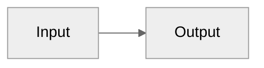
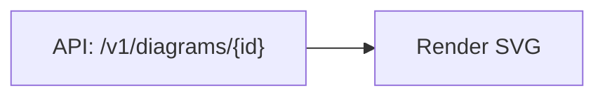
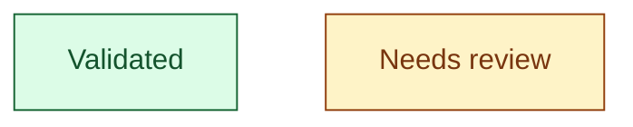

# Mermaid security and rendering notes

## Default safety posture

Assume diagrams render in Markdown, documentation sites, issue comments, or CI previews. Use a
conservative posture:

- Prefer plain text labels over raw HTML.
- Assume `securityLevel: strict` unless the user explicitly asks for trusted HTML behavior.
- Do not include secrets, tokens, internal URLs, or customer data in diagrams.
- Avoid links that trigger external navigation unless the user requested linked diagrams.
- Prefer deterministic layout and stable IDs for diagrams committed to source control.

## Markdown renderer compatibility

Mermaid support varies by host. GitHub Markdown supports Mermaid fences, but it may not match the
newest upstream Mermaid release. When broad compatibility matters:

1. Prefer stable diagram types: flowchart, sequence, class, state, ER, Gantt, pie, journey,
   gitGraph.
2. Avoid beta prefixes unless the host is known to support them.
3. Keep initialization directives minimal.
4. If a newer feature is necessary, add a note such as: "Requires Mermaid 11.14+ renderer support."

## Initialization directives

Use directives only when they solve a real problem:

Avoid global configuration blocks in shared docs unless the user controls the renderer. They can be
ignored or rejected by older hosts.

## Label escaping

Common parse failures come from punctuation-heavy labels. Prefer quoted labels:

If labels contain Markdown link syntax, pipes, or nested brackets, simplify the text before trying
complex escaping.

## Styling discipline

Use styling to encode meaning, not decoration:

Keep class names semantic (`success`, `warning`, `external`) so future agents can maintain the
diagram.
