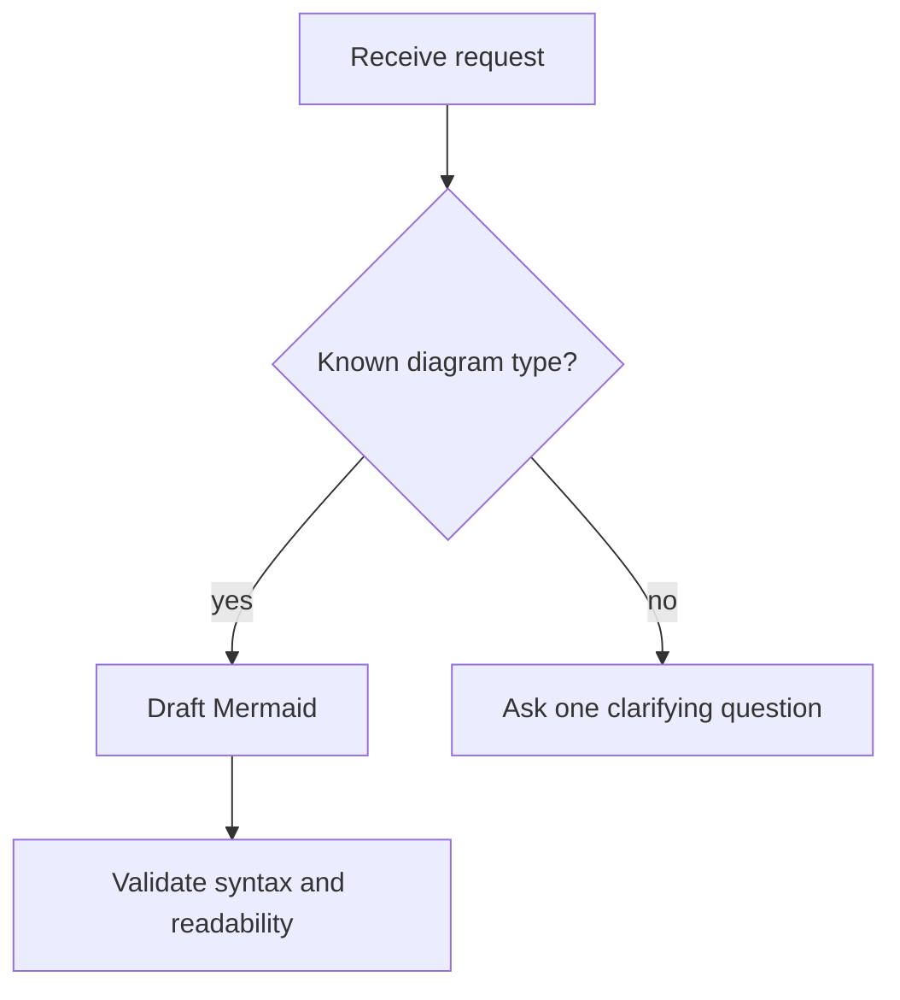
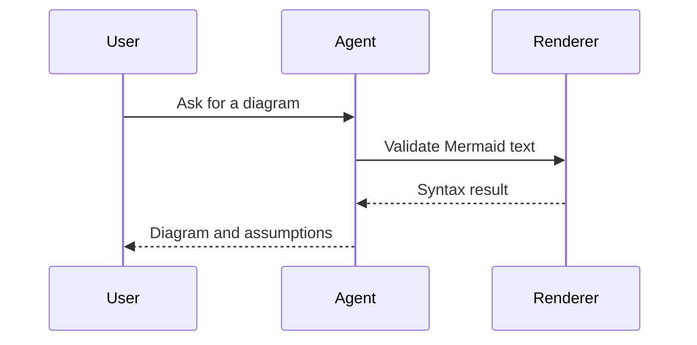
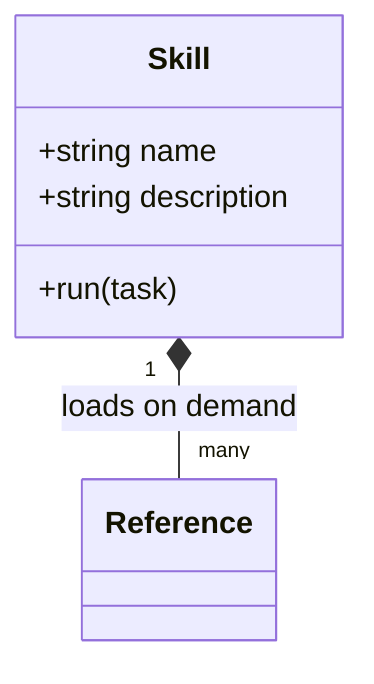
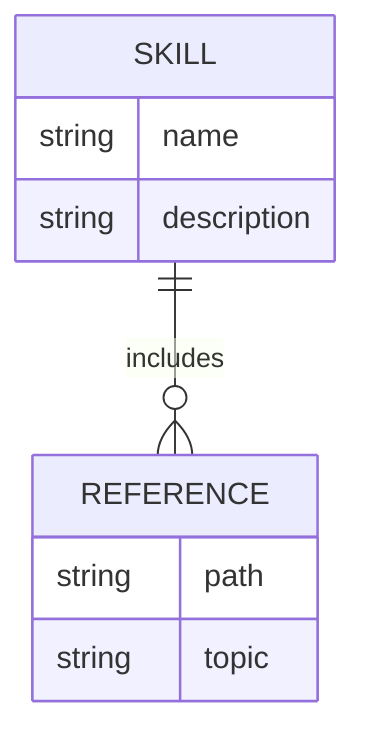
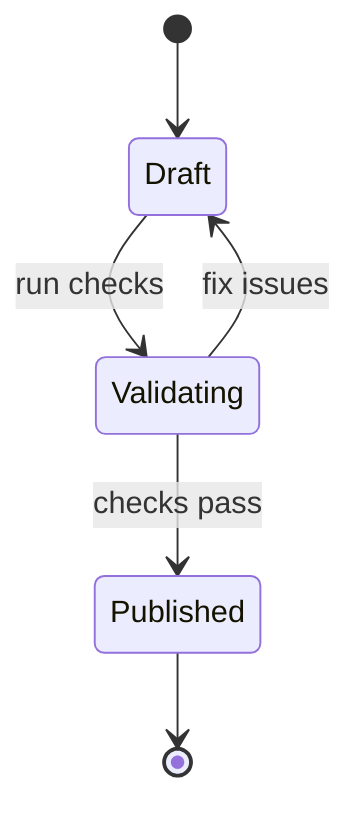
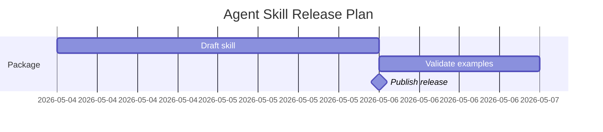
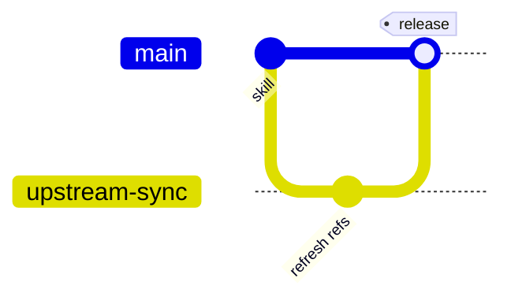
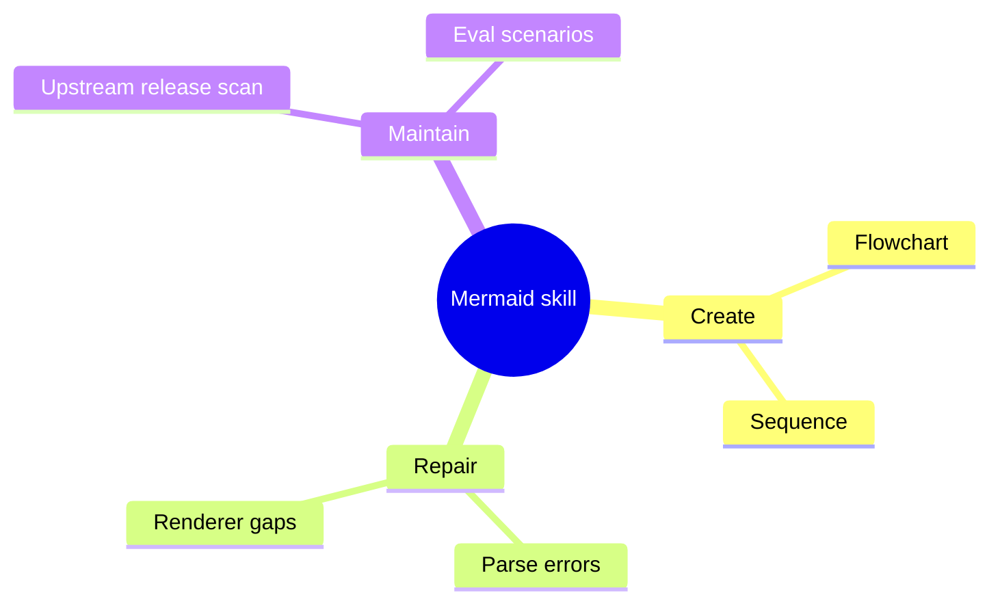
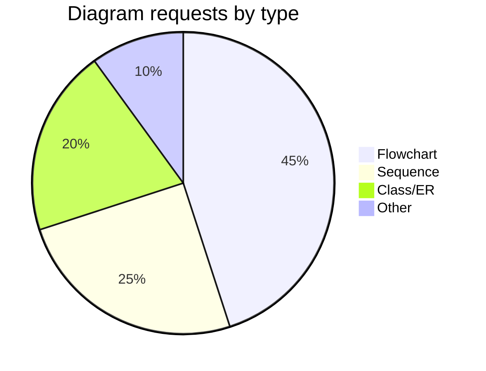
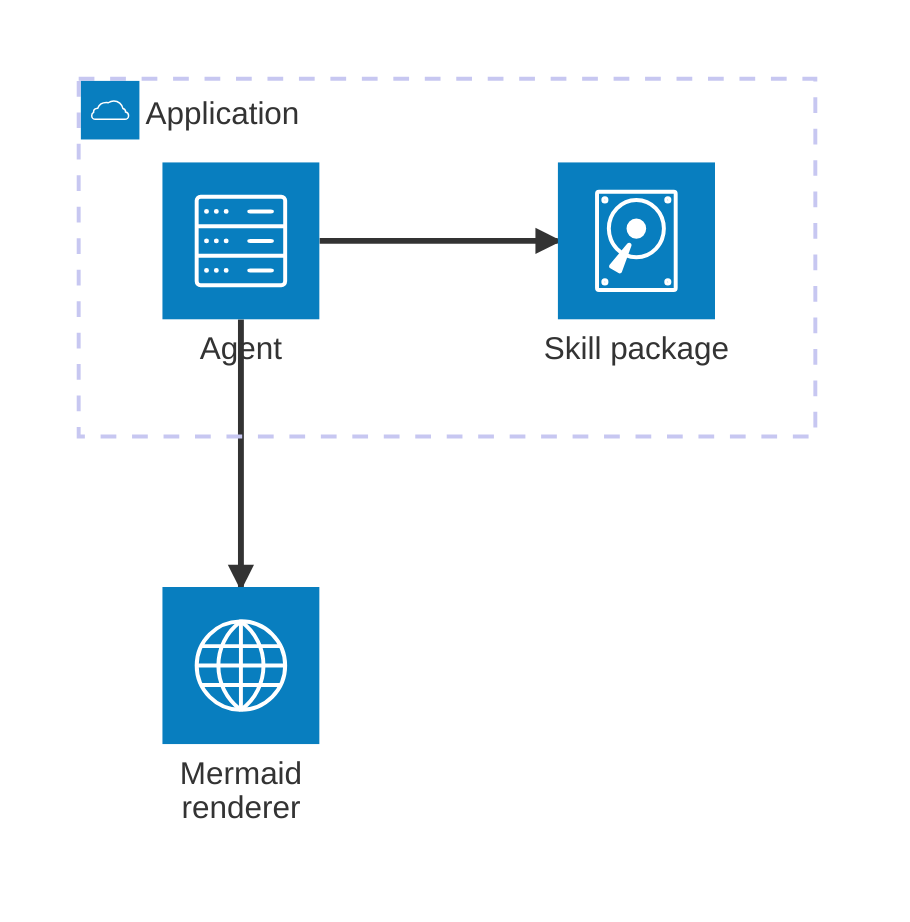

# Mermaid syntax cheatsheet for agents

These examples are intentionally small and diff-friendly. Expand them only when the user's context
requires it.

## Flowchart



Tips:

- Use `TD` for processes and `LR` for pipelines or dependencies.
- Use stable IDs (`request`) plus readable labels (`[Receive request]`).
- Quote complicated labels: `node["Label with /, :, or ( )"]`.
- Keep one edge per line.

## Sequence diagram



Tips:

- Prefer explicit `participant` declarations for stable names.
- Use `->>` for calls, `-->>` for responses, and `-)` for async sends when supported.
- Use `alt`, `opt`, `loop`, and `par` blocks sparingly.

## Class diagram



Tips:

- Use class diagrams for type/API shape, not database schema.
- Escape or simplify generic type syntax if a renderer rejects it.

## ER diagram



Tips:

- Use ER for entities and cardinality.
- Keep relationship labels short and verb-like.

## State diagram



Tips:

- Use state diagrams for lifecycle, status, and mode changes.
- If a state has many internals, split into another diagram.

## Gantt



Tips:

- Include `dateFormat` before dated tasks.
- Prefer explicit IDs for dependencies.

## Git graph



## Mindmap



## Pie



## Architecture beta



Use only when the target renderer supports `architecture-beta`.

## Wardley beta

```mermaid
wardley-beta
  title Agent Skill Value Chain
  anchor Agent [0.95, 0.35]
  component Mermaid guidance [0.75, 0.35]
  component Upstream docs [0.55, 0.65]
  Agent -> Mermaid guidance
  Mermaid guidance -> Upstream docs
```

Use for strategy/evolution maps. Mention beta renderer support when sharing outside this package.
