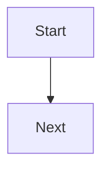

# Create a Mermaid diagram workflow

Use this when the user wants a new diagram.

1. **Clarify only if needed.** If purpose, audience, or diagram type is missing, ask one concise
   question. Otherwise proceed.
2. **Choose the type.** Use `references/diagram-types.md` when the choice is not obvious.
3. **Draft small.** Start with the important relationships. Keep the diagram editable.
4. **Check syntax shape.** Compare against `references/syntax-cheatsheet.md`.
5. **Check rendering context.** If the target is GitHub Markdown, avoid beta syntax unless required.
6. **Return useful output.** Put the Mermaid block first. Follow with a one-paragraph note about
   assumptions or how to extend it.

Default response shape:

````markdown


Assumptions: ...
````
