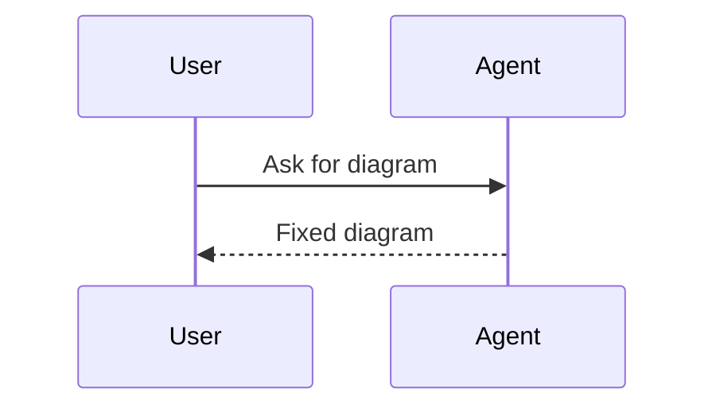

# Repair a Mermaid diagram workflow

Use this when the user provides broken Mermaid syntax or says a renderer fails.

1. **Identify the renderer if provided.** GitHub, Mermaid Live Editor, VitePress, and older embedded
   renderers may differ.
2. **Find the first likely syntax error.** Common causes are unmatched delimiters, punctuation-heavy
   labels, invalid edge labels, or using a beta type in an older renderer.
3. **Apply the smallest fix.** Preserve the user's diagram type, naming, and relationships.
4. **Normalize only when beneficial.** For example, prefer `flowchart` over old `graph` only if it
   reduces ambiguity.
5. **Explain the change briefly.** Do not write a long Mermaid tutorial unless asked.
6. **Offer validation.** If scripts are available, run or suggest
   `node scripts/validate-mermaid-examples.mjs`.

Return shape:

````markdown


Changed: quoted labels containing colons and replaced one invalid edge label.
````
